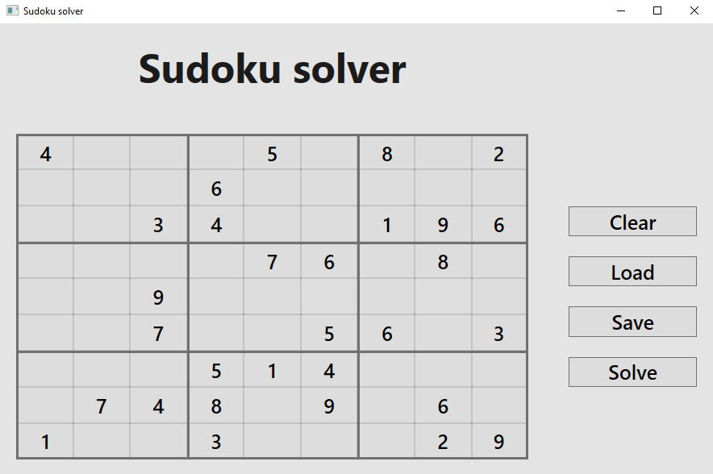
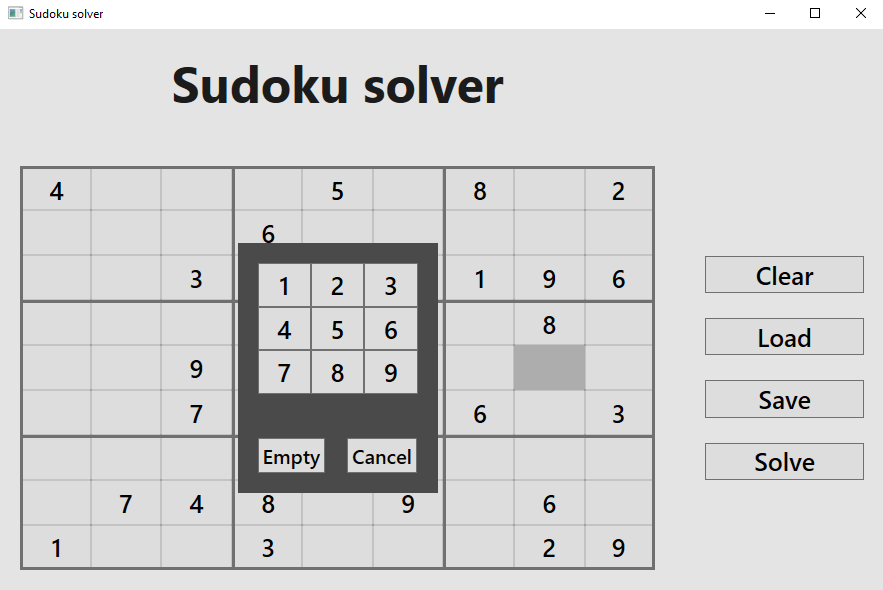

## README:

Sudoku solver application. User can create new game or load saved game from a txt file to solve. User can also save a current game into txt file. The application solves the input game if it can be solved. The application does not display the solution procedure.
 
The application is build on .NET 8 platform - frontend in WPF, backend in C#.
 

 
Author: Matěj Cukr
